# 🚀 StudyBuddy — AI-Powered Study Companion

<p align="center">
  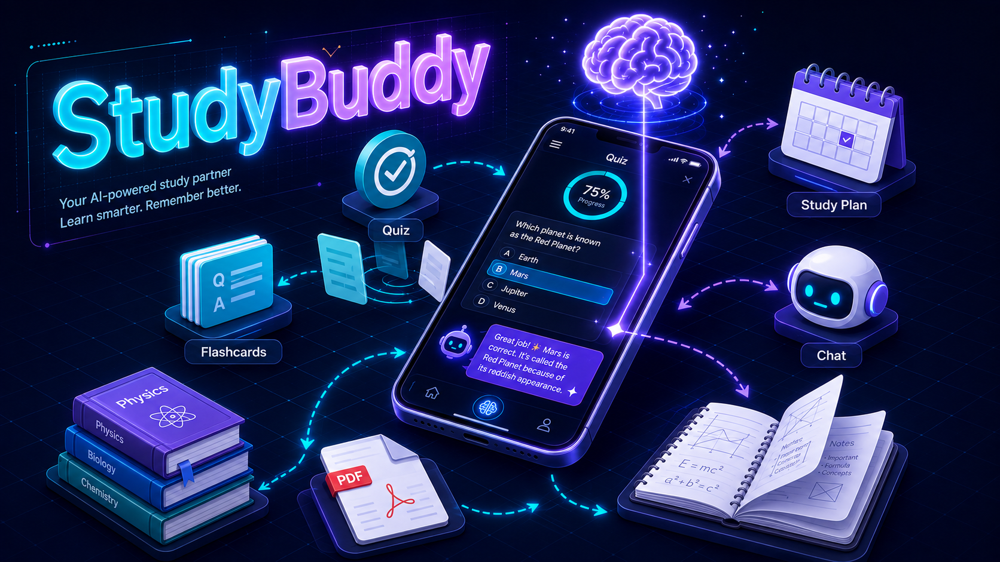
</p>

<h3 align="center">
Flutter AI Study App — Question Generation, Quizzes, Flashcards, Study Plans & AI Chat
</h3>

<p align="center">


</p>


---


A modern **AI-powered study companion** built with **Flutter**, **BLoC**, and **SQLite**.


The app turns your study materials (PDF, Word or plain-text notes) into interactive learning tools: it generates AI summaries, flashcards, quizzes and study plans, lets you chat with your notes, tracks weak areas, and reminds you to study — all offline-first, with your data stored locally on your device.


---

# 📌 Overview

Study materials — lecture notes, textbook chapters, research papers — hold the information you need to learn, but passively reading them is rarely enough to remember. Active recall, spaced practice and self-testing are what actually move knowledge into long-term memory.

Typical study workflows include:

* 📄 Importing lecture notes and textbook chapters
* 🃏 Flashcards for rapid active-recall practice
* ❓ Quizzes with instant feedback and score tracking
* 🗓️ Study plans that break big topics into a day-by-day checklist
* 💬 Asking questions about your notes in natural language
* 📈 Reviewing past quiz results and weak areas
* ⏰ Daily reminders so you never miss a study session

Traditional studying is challenging because of:

* Hand-made flashcards that take hours to prepare
* Quizzes that require writing your own questions
* No feedback on which topics you keep getting wrong
* No structure or plan for how to study a new subject
* Reading notes over and over without real engagement

This project automates the complete workflow: import a document once, and StudyBuddy generates **AI-powered flashcards, quizzes, summaries, study plans and chat answers** — all from your own material, all stored locally on your device.

---

# 🚀 Key Features

| Feature                                   | Status |
| ----------------------------------------- | :----: |
| PDF / Word / TXT Material Import          |    ✅   |
| AI Question Generation (Multiple Choice)  |    ✅   |
| AI Flashcard Generation                   |    ✅   |
| Flashcard Session with Mastery Rating     |    ✅   |
| Weak Cards Tracking & Review              |    ✅   |
| Quiz Mode with Score Summary              |    ✅   |
| Review Wrong Answers                      |    ✅   |
| Quiz History                              |    ✅   |
| AI Study Plan Generation (Day-by-Day)     |    ✅   |
| AI Chat with Your Notes                   |    ✅   |
| Material Search                           |    ✅   |
| Edit & Delete Materials                   |    ✅   |
| Daily Study Reminders (Local Notifications) |  ✅   |
| Light / Dark / Auto Theme                 |    ✅   |
| Backup & Restore (JSON Export / Import)   |    ✅   |
| Local SQLite Storage (Offline-First)      |    ✅   |
| OpenAI-Compatible API (Any Provider)      |    ✅   |

---

# 🏗️ System Architecture

<p align="center">
  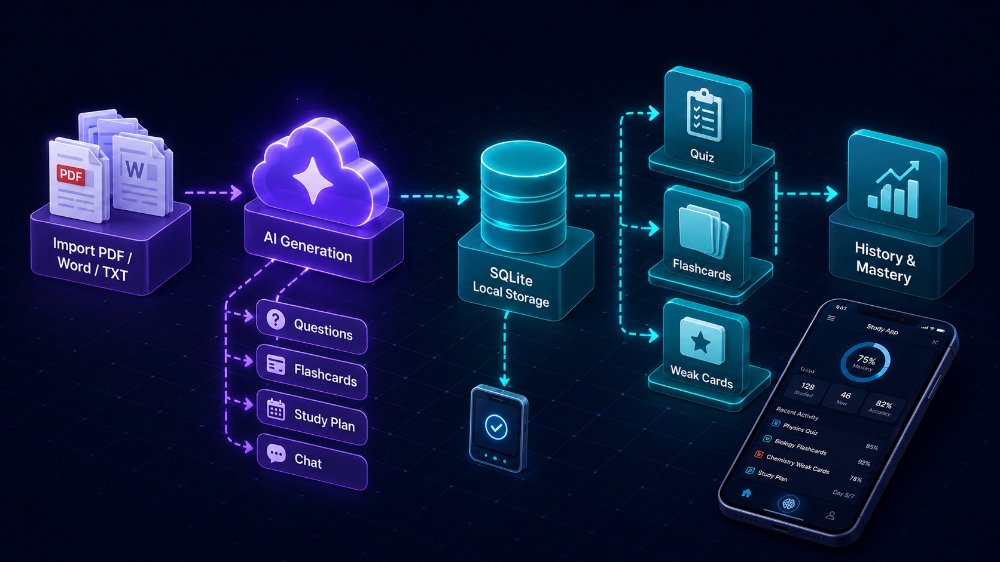
</p>

The app is organised into three primary layers:

* **Presentation Layer** — Flutter screens (Home, Materials, Quiz, Flashcards, Study Plan, Chat, Settings) driven by BLoC state management.
* **Data Layer** — SQLite (sqflite) stores materials, flashcards, questions and quiz results; SharedPreferences stores AI settings, theme and reminder preferences.
* **AI Services Layer** — HTTP calls to any OpenAI-compatible API (e.g. Google Gemini) for question generation, flashcard creation, study plans and chat.

**Processing pipeline:** a document is imported → the AI service generates questions and flashcards from the content → quizzes and flashcard sessions are run locally → results and mastery ratings are saved to the local database → weak cards feed back into future sessions, and quiz history powers the review screen.

```text
Import PDF / Word / TXT
          │
          ▼
Document Text Extraction (pdfrx / File Picker)
          │
          ▼
AI Generation (OpenAI-Compatible API)
          ├── ▶ Quiz Questions (MCQ)
          ├── ▶ Flashcards (Q / A pairs)
          ├── ▶ Study Plan (day-by-day checklist)
          └── ▶ Chat Answers (context-aware)
          │
          ▼
Local Storage (SQLite + SharedPreferences)
          │
          ▼
Study Sessions: Quiz Mode · Flashcards · Weak Cards · Review Wrong Answers
          │
          ▼
Results & Mastery Saved → Quiz History / Weak Card Tracking
```

---

# 🧩 App Screens

The app uses a bottom navigation bar with three main tabs:

| Tab        | Contents |
| ---------- | -------- |
| 🏠 **Home**      | Dashboard with your materials, recent activity and quick-start actions |
| 📚 **Materials** | Material list, search, import, detail view (Ask AI / Edit / Delete / Weak cards / History) |
| ⚙️ **Settings**  | AI API configuration, theme, study reminders, backup & restore |

---

# 📸 Screenshots

| 🏠 Home | 📚 Materials |
| :-: | :-: |
| 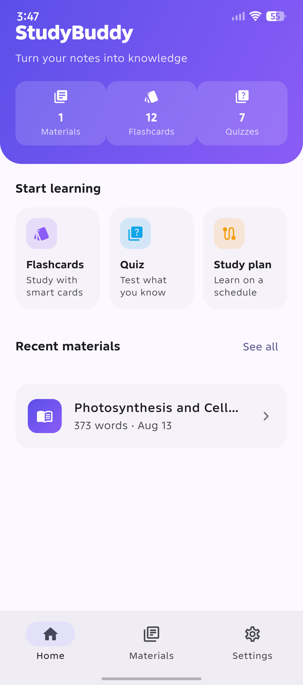 | 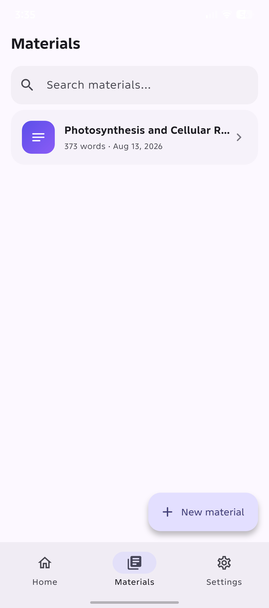 |

| 📄 Material Detail | 🃏 Flashcards |
| :-: | :-: |
| 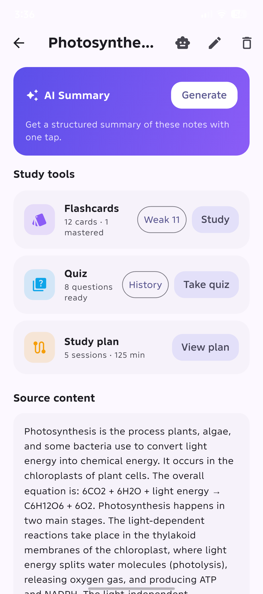 | 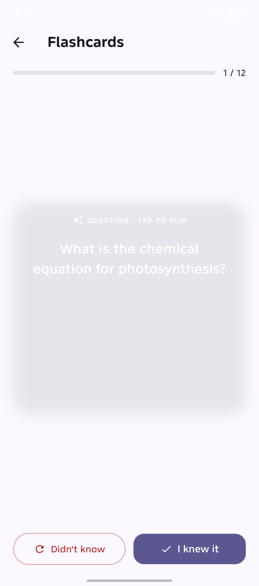 |

| ❓ Quiz | 📊 Quiz Summary |
| :-: | :-: |
| 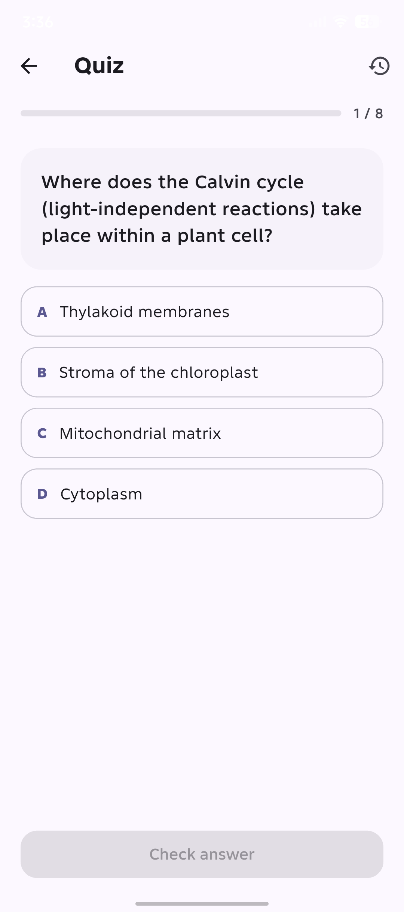 | 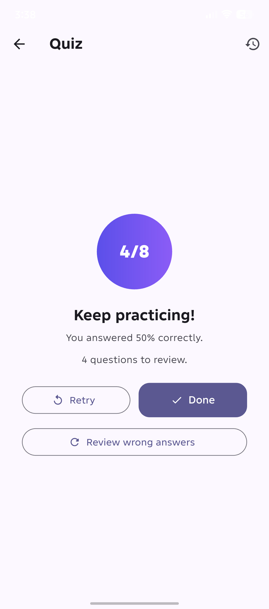 |

| 🗂️ Quiz History | 🗓️ Study Plan |
| :-: | :-: |
| 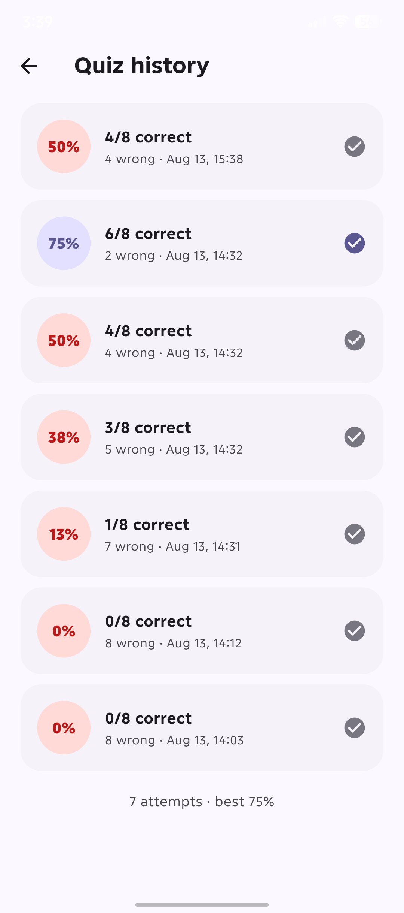 | 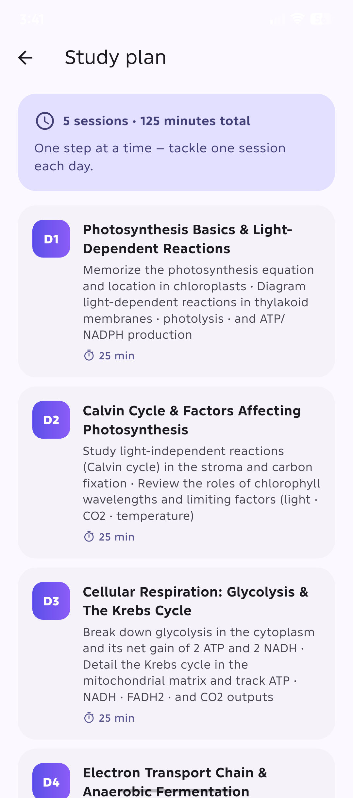 |

| 💬 AI Chat | ⚙️ Settings |
| :-: | :-: |
| 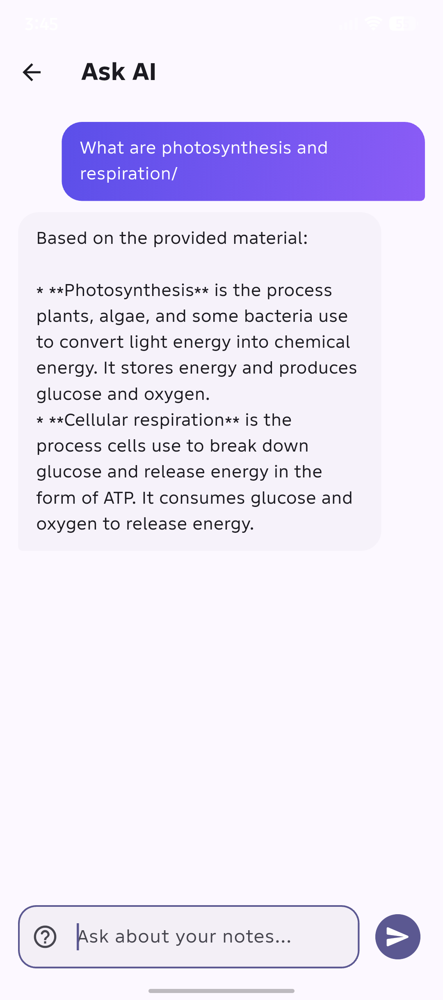 | 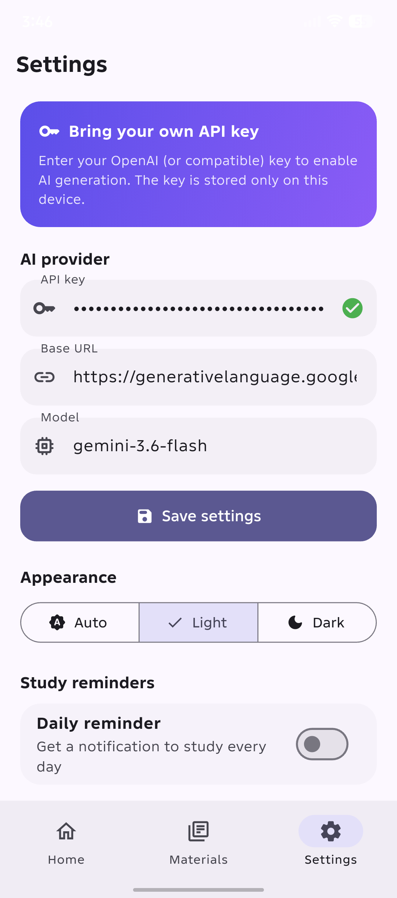 |

| 💾 Backup & Restore |
| :-: |
| 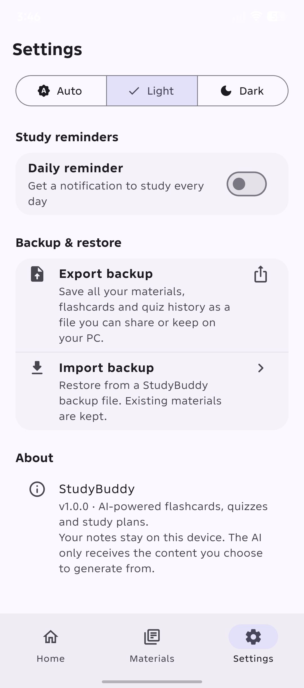 |

---

# ✨ Features

## 📄 Material Import & Management

* Import documents as PDF, Word (.docx) or plain text (.txt) via the system file picker
* PDF text extraction powered by `pdfrx` (works without third-party services)
* Search your material library instantly by title
* Edit material titles and content, or delete materials you no longer need

---

## 🃏 AI Flashcards

* The AI generates Q/A flashcard pairs from your material content
* Study in an interactive session: flip the card, test yourself, then rate your answer
* Mastery is tracked per card — cards you rate as weak are collected into a **Weak Cards** session so you can drill exactly what you keep forgetting

---

## ❓ AI Quizzes

* AI-generated multiple-choice questions from your notes
* Answer in a session, get an instant score summary
* **Review wrong answers** — replay only the questions you missed
* Every result is saved to **Quiz History** so you can track your progress over time

---

## 🗓️ AI Study Plans

* The AI breaks any material into a structured, day-by-day study plan
* Each day lists concrete topics and tasks — check them off as you complete them

---

## 💬 AI Chat with Your Notes

* Ask questions in natural language about any material
* The AI answers with the document's content as context — no more digging through pages to find an explanation

---

## ⏰ Study Reminders

* Set a daily reminder time in Settings
* The app schedules a local notification (works even when the app is closed) and can reschedule it after a device reboot
* Powered by `flutter_local_notifications` with proper timezone handling

---

## 🎨 Theme & Personalisation

* Light / Dark / System (Auto) theme switcher — applied instantly and remembered
* Material Design 3 with dynamic color scheme

---

## 💾 Backup & Restore

* One-tap export: your entire library is written to a timestamped JSON file and shared via the system share sheet
* Restore from any previously exported file through the system file picker

---

# 📂 Project Structure

```text
Study_Buddy/
│
├── android/                        # Android platform configuration
│   └── app/
│       ├── build.gradle.kts        # Desugaring, minSdk, release config
│       └── src/main/AndroidManifest.xml   # POST_NOTIFICATIONS + boot receiver
│
├── ios/                            # iOS platform shell (untested)
│
├── lib/
│   ├── main.dart                   # App entry, reminder rescheduling
│   ├── app.dart                    # Root widget + theme wiring
│   ├── app_shell.dart              # Bottom navigation shell
│   ├── core/
│   │   ├── theme/app_theme.dart    # Material 3 theme (light / dark)
│   │   └── widgets/hero_widgets.dart
│   ├── data/
│   │   ├── database/app_database.dart      # SQLite schema + migrations
│   │   ├── models/                 # ai_settings, flashcard, quiz_question,
│   │   │                           # quiz_result, study_material, study_plan
│   │   ├── repositories/study_repository.dart  # All DB access
│   │   └── services/
│   │       ├── ai_service.dart     # OpenAI-compatible API client
│   │       ├── backup_service.dart # JSON export / import
│   │       ├── json_utils.dart     # Strict JSON parsing helpers
│   │       └── reminder_service.dart  # Local notifications + timezone
│   └── features/
│       ├── chat/presentation/chat_screen.dart
│       ├── flashcards/
│       │   ├── presentation/flashcard_study_screen.dart
│       │   └── state/flashcard_session_bloc.dart
│       ├── generator/state/generator_bloc.dart   # AI generation state
│       ├── home/presentation/home_screen.dart
│       ├── materials/
│       │   ├── presentation/       # add / edit / list / detail screens
│       │   └── state/material_bloc.dart
│       ├── quiz/
│       │   ├── presentation/       # quiz_screen, quiz_history_screen
│       │   └── state/quiz_session_bloc.dart
│       ├── settings/
│       │   ├── presentation/settings_screen.dart
│       │   └── state/settings_bloc.dart
│       └── study_plan/presentation/study_plan_screen.dart
│
├── test/                           # 17 unit + widget tests
├── .gitignore
├── pubspec.yaml
└── README.md
```

---

# 💻 Installation

## Prerequisites

* [Flutter SDK](https://docs.flutter.dev/get-started/install) (3.47 or newer) with the Android toolchain
* An API key from any **OpenAI-compatible** provider (the app defaults to the OpenAI format; Google Gemini's OpenAI-compatible endpoint works out of the box)

## Clone Repository

```bash
git clone https://github.com/huzaifa-ai-tech/Study_Buddy.git

cd Study_Buddy
```

## Get Dependencies

```bash
flutter pub get
```

## Run the App

```bash
flutter run
```

Build a release APK:

```bash
flutter build apk --release
```

## Configure the AI

1. Open the app → **Settings**
2. Paste your API key and (optionally) change the base URL / model
3. Defaults: `https://api.openai.com/v1` with model `gpt-4o-mini` — any OpenAI-compatible endpoint (e.g. Gemini `generativelanguage.googleapis.com/v1beta/openai`) works

Your key is stored only in the app's local preferences — it is never included in the repository or the app binary.

## Android Notes

* The project enables Java 8+ desugaring (required by `flutter_local_notifications`)
* The manifest requests the `POST_NOTIFICATIONS` permission so reminders can be scheduled on Android 13+

---

# 🧪 Testing

```bash
flutter test
```

The test suite covers repository logic, quiz/flashcard session state, AI service parsing, and widget navigation (17 tests, all passing).

```bash
flutter analyze
```

The analyzer runs clean with zero issues.

---

# 🛠️ Technologies Used

## 🎨 Frontend / App

* Flutter + Dart
* BLoC (flutter_bloc) state management
* Material Design 3
* equatable

## 🗄️ Storage

* sqflite (SQLite) — materials, flashcards, questions, quiz results
* shared_preferences — settings, theme, reminders

## 🤖 AI

* OpenAI-compatible REST API (HTTP client)
* Works with OpenAI, Google Gemini, and any compatible provider
* PDF text extraction via pdfrx

## 🔧 Platform

* file_picker — document import / backup restore
* share_plus — backup export sharing
* flutter_local_notifications + timezone + flutter_timezone — study reminders
* path_provider — app documents directory

---

# ⚡ Advantages

* **Offline-first** — your library lives in a local SQLite database; the AI is only needed when generating new content
* **Your own materials** — everything is generated from your documents, not generic content
* **Any AI provider** — OpenAI-compatible API means no vendor lock-in
* **Active recall built in** — quizzes, flashcards and weak-card drills are designed around proven study techniques
* **Review your mistakes** — wrong answers are replayable, and history tracks every attempt
* **Privacy-friendly** — API key stored locally, data never leaves your device except when you export a backup
* **One-tap backup** — export everything to a shareable JSON file and restore anywhere
* **Zero-config reminders** — daily study notifications with reboot rescheduling

---

# ⚠️ Limitations

* **AI API key required** — question, flashcard, study plan and chat generation need a configured key; core material management works without one
* **Android-focused** — the app is built and tested on Android; iOS/desktop shells exist but are not verified
* **Document import** — PDFs must contain extractable text; scanned/image-only PDFs cannot be parsed
* **Reminder permission** — Android 13+ asks for notification permission before reminders can fire
* **No cloud sync** — data is local to the device (use Backup & Restore to move it)

---

# 🔮 Future Improvements

Completed enhancements:

* ✅ Weak-card tracking with dedicated review sessions
* ✅ Quiz history with wrong-answer review
* ✅ Light / Dark / Auto theming
* ✅ Daily reminders with reboot rescheduling
* ✅ JSON backup / restore

Planned enhancements:

* Spaced-repetition scheduling (SM-2 style) for flashcard review
* Streaks and study statistics dashboard
* Deleting individual quiz history entries
* Cloud sync across devices
* iOS / desktop support verification
* First-run onboarding tutorial
* Multiple AI provider profiles

---

# 👨‍💻 Author

**Huzaifa**

GitHub:
https://github.com/huzaifa-ai-tech

---

# 🙏 Acknowledgements

This project is built using several outstanding open-source technologies:

* [Flutter](https://flutter.dev/)
* [BLoC](https://bloclibrary.dev/)
* [sqflite](https://pub.dev/packages/sqflite)
* [pdfrx](https://pub.dev/packages/pdfrx)
* [flutter_local_notifications](https://pub.dev/packages/flutter_local_notifications)
* [Google Gemini](https://ai.google.dev/gemini-api/docs/openai) (OpenAI-compatible endpoint)

Special thanks to the open-source community for providing these powerful tools and frameworks that made this project possible.

---

# ⚠️ Disclaimer

This project is developed for educational purposes.

AI-generated questions, flashcards and answers may not always be 100% accurate. Always verify critical information against your original study materials before relying on it in exams or professional contexts.

---

# ⭐ Support

If you found this project useful, please consider giving it a **⭐ Star** on GitHub.

Your support helps improve the project and motivates future development.